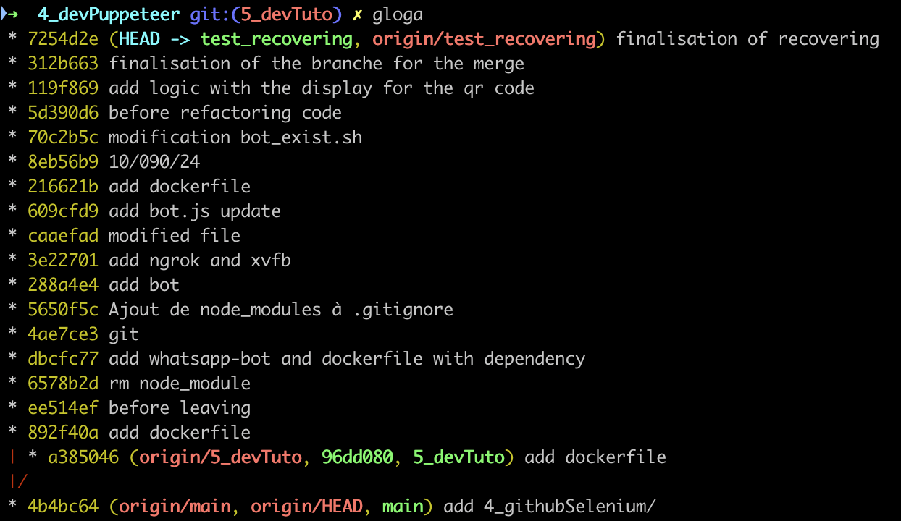

# git_cmd
A little repo for the trouble I have for the complex git command.

# Squash de Commits Git

Ce guide explique comment squash (fusionner) plusieurs commits en un seul dans Git, tout en préservant certains commits récents.

## Prérequis

- Git installé sur votre système
- Accès en écriture au dépôt distant

## Étapes

<kbd>  </kbd>

1. **Checkout de la branche**

  `git checkout branch`


2. **Lancer le rebase interactif**

  `git rebase -i 892f40a^`
  
3. **Modifier la liste des commits**
Dans l'éditeur qui s'ouvre, modifiez la liste comme suit :
- Laissez `pick` pour le premier commit (892f40a) et les 5 derniers commits
- Changez les autres en `squash`

  ```
  pick 892f40a add dockerfile
  squash ee514ef before leaving
  squash 6578b2d rm node_module
  squash dbcfc77 add whatsapp-bot and dockerfile with dependency
  squash 4ae7ce3 git
  squash 5650f5c Ajout de node_modules à .gitignore
  squash 288a4e4 add bot
  squash 3e22701 add ngrok and xvfb
  squash caaefad modified file
  squash 609cfd9 add bot.js update
  squash 216621b add dockerfile
  squash 8eb56b9 10/090/24
  pick 70c2b5c modification bot_exist.sh
  pick 5d390d6 before refactoring code
  pick 119f869 add logic with the display for the qr code
  pick 312b663 finalisation of the branche for the merge
  pick 7254d2e finalisation of recovering


4. **Éditer le message de commit**
- Sauvegardez et fermez l'éditeur
- Dans le nouvel éditeur, rédigez un message résumant tous les changements squashés

5. **Vérifier le résultat**

  `git log`

  
6. **Pousser les changements**

  `git push --force origin branch`


## Avertissements

- Cette opération modifie l'historique Git
- L'utilisation de `--force` écrase l'historique distant
- Résolvez manuellement les conflits éventuels

## En cas de problème

  Pour annuler le rebase : `git rebase --abort`
  
## Résultat

Après ces étapes, les commits entre 892f40a et 8eb56b9 (inclus) seront fusionnés en un seul, tandis que les 5 derniers commits resteront inchangés.

## recuperer un commit avec reflog

# Récupération de Commits Perdus avec Git Reflog

Ce guide explique comment utiliser `git reflog` pour récupérer des commits perdus dans Git.

## Prérequis

- Git installé sur votre système
- Un dépôt Git avec des commits perdus à récupérer

## Étapes de Récupération

1. **Afficher le Reflog**

  `git reflog`

Cette commande affiche l'historique des opérations Git, y compris les commits perdus.

2. **Identifier le Commit Perdu**
- Examinez la sortie du reflog
- Recherchez le hash du commit perdu et l'action qui a causé sa perte (ex: reset, suppression de branche)

3. **Créer une Nouvelle Branche**

  `git branch <nom-de-branche> <hash-du-commit>`

Remplacez `<nom-de-branche>` par un nom approprié et `<hash-du-commit>` par le hash identifié.

4. **Vérifier la Récupération**

  `git log`

Vérifiez que la nouvelle branche contient bien le commit récupéré.

## Exemple

```
git reflog
# Identifiez le hash du commit perdu, par exemple abc123

  `git branch recuperation abc123`

  `git log recuperation`

# Vérifiez que le commit est présent dans la nouvelle branche


# Guide de Suppression de Branche Git

Ce guide explique comment supprimer définitivement une branche Git, à la fois localement et sur le dépôt distant.

## Étapes de Suppression

### 1. Suppression de la Branche Locale


  `git branch -D 5_devTuto`

Note : L'option -D force la suppression même si la branche n'a pas été fusionnée.
2. Suppression de la Branche Distante


`git push origin --delete 5_devTuto`

3. Vérification
Après la suppression, vérifiez que la branche a bien été supprimée :

    Pour les branches locales :

    
    `git branch -a`

Pour les branches distantes :


  `git ls-remote --heads origin`

4. Nettoyage des Références Obsolètes (Optionnel)
Si des références à la branche supprimée persistent :


  `git fetch --all --prune`

5. Suppression d'un Tag Associé (Si Nécessaire)
Si '96dd080' est un tag :

  ```
  git tag -d 96dd080
  git push origin :refs/tags/96dd080


Avertissements

  La suppression d'une branche est irréversible. Sauvegardez ou fusionnez tout travail important avant la suppression.
  Informez les autres utilisateurs de la branche avant de la supprimer.
  Assurez-vous d'avoir les permissions nécessaires pour supprimer une branche distante.

Résultat
Après ces étapes, la branche '5_devTuto' sera complètement supprimée du dépôt local et distant. Le commit 'a385046' deviendra inaccessible, sauf s'il est référencé par une autre branche ou un tag.
